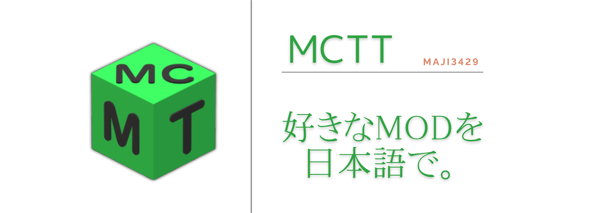

  

# **MineCraft-Mod-Translate-Tool**
Minecraft Java Editionの一部のMODを簡単に翻訳するリソースパックを作成できます。  

## 🚀使い方  
1. Releasesからファイルをダウンロードして任意のフォルダーの中に配置してください。(起動時に`logs`フォルダや`temp`フォルダが作成されます)または自分でコンパイルすることもできます。
2. ソフトを起動します。
3. 翻訳するMODのバージョンを選択します。
4. 手動でファイルを選択します。もしくは、`mods`フォルダーのパスをクリップボードにコピーしてボタンをクリックし、**しばらくまつと**翻訳が開始されます。
5. 翻訳が完了するまで待ってください。
6. 実行ファイルと同じ階層に `translate_rp` というフォルダがあるのでマインクラフト内でリソースパックとして読み込ませてください。
7. MODで追加されたアイテムの名前などが翻訳されます。

## ⚡️注意点  
> [!CAUTION]
> このソフトウェアは、個人の使用を目的として作成されたものであり、非公式です。  
> 本ソフトウェアの使用により発生したいかなる損害や問題について、作成者は一切の責任を負いません。  
> 使用は自己責任で行ってください。  
> 翻訳したファイルは個人使用にしてください。配布はご遠慮ください。   
- 言語ファイルを持たないMODは翻訳できません。(Essential Modなど)  
- Bedrock版のアドオンや、Lunar Clientのようなどのクライアントは翻訳できません。比較的新しいバージョンのJava Edition MODのみ翻訳できます。  
- **最初のバージョン選択画面に自分の使用したいMODのマインクラフトバージョンがない場合は、ツールに表示されている中で一番新しいバージョンを選択し、ゲーム内でリソースパックとして読み込むときに警告を無視すれば問題なく動作します。** 
- 翻訳時に変数が誤動作を引き起こしてゲーム内での表示が崩れる場合があります。issueにてMOD名とバージョンとともに教えてくださると助かります。  
- 有料のGoogle翻訳APIキーは必要はありません。Pythonの**googletrans(4.0.0rc1)**による無料の翻訳です。そのため、翻訳の品質はGoogle翻訳の結果に依存します。動作が不安定な場合があるそうです。
- 大量のファイルを一度に翻訳すると、Google翻訳の制限に達する可能性があります。その場合、一定時間待つことで再度翻訳を行うことができます。
> [!NOTE]
> 当方GitHub・プログラミング初心者であるため、何か慣習的に良くないことをしている可能性があります。issueにて教えていただけるとありがたいです。 

## 📒改善点
-  [ ] ~~翻訳元と翻訳先の言語を選択できるようにする~~(有名になったらいずれやる)
-  [ ] MODの中にあるMODが翻訳されない問題(これも有名になったら)
-  [ ] グーグルスプレッドシート等を利用してすでに翻訳したことのあるMODの言語ファイルを呼び出せるようにする(権利問題の可能性？)
-  [ ] 出力されたリソースパックを自動でクリップボードにコピーする(技術的に不可能?)
-  [x] UIの改善
-  [x] tempフォルダを自動作成
-  [x] バージョン未選択時のダイアログ
-  [x] 翻訳完了時の通知~~と通知音の設定~~を追加
-  [x] **並列処理による複数MODの同時翻訳**
